# 🚀 DeliverIQ — Zomato Delivery Analytics & Prediction


> **Predicting and analyzing food delivery times to identify operational inefficiencies across cities, weather conditions, and traffic patterns — using a full analytics pipeline from SQL to Machine Learning.**

---

## 📌 Problem Statement

Food delivery platforms face a core challenge: **unpredictable delivery times** hurt customer satisfaction and operational planning. This project analyzes **45,584 Zomato delivery records** to uncover what drives delivery delays and builds a machine learning model to predict delivery time within ±4 minutes.

---

## 🗂️ Project Structure

| File | Description |
|------|-------------|
| `Data_prep.ipynb` | Data cleaning, outlier handling, feature engineering |
| `EDA.ipynb` | 10 exploratory visualizations with dark-theme styling |
| `model_training.ipynb` | 3 ML models trained, evaluated, and compared |
| `zomato_load.sql` | MySQL data warehouse setup with indexes |
| `zomato_queries.sql` | 20 advanced SQL queries with window functions |

---

## ⚙️ Pipeline

```
Raw CSV → Data Cleaning → Feature Engineering → EDA → SQL Analysis → ML Modeling
```

**1. Data Cleaning** — Handled 8 columns with missing values (~8,000 rows), capped ratings at 5.0, converted timestamps to datetime

**2. Feature Engineering** — Created `Distance_km` (Haversine formula), `Preparation_time_minutes`, `Order_hour`, `Order_day_of_week`

**3. EDA** — 10 visualizations revealing delivery patterns across city, weather, traffic, and time

**4. SQL** — 20 queries including window functions (`RANK`, `ROW_NUMBER`, `LAG`, `SUM OVER`) loaded into MySQL star schema

**5. ML** — 3 regression models trained to predict `Time_taken(min)`

---

## 📊 Exploratory Data Analysis

### Delivery Time by City
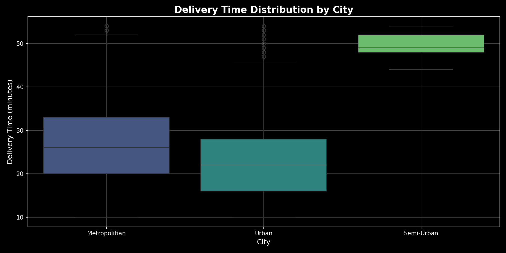

### Delivery Time by Weather Condition
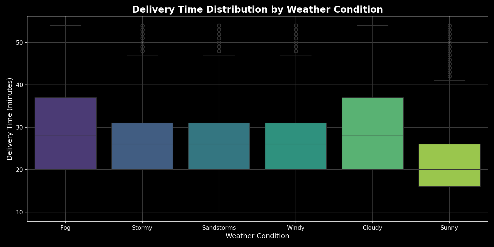

### Delivery Time by Road Traffic Density
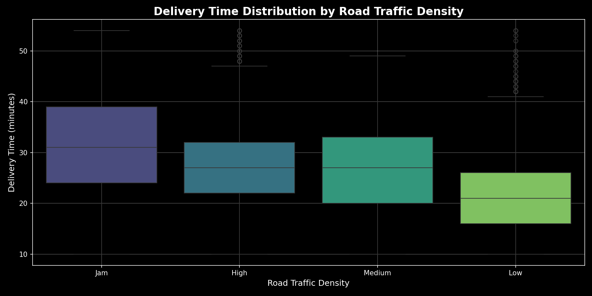

### Peak Order Hours Heatmap
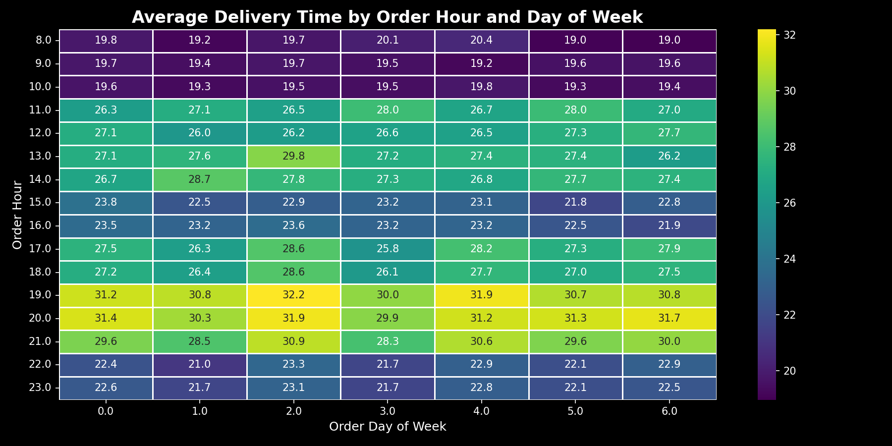

### Distance vs Delivery Time
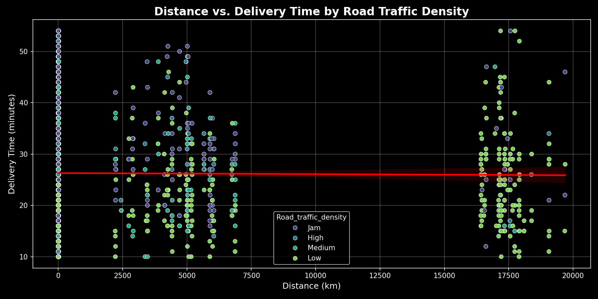

### Delivery Person Ratings by Vehicle Type
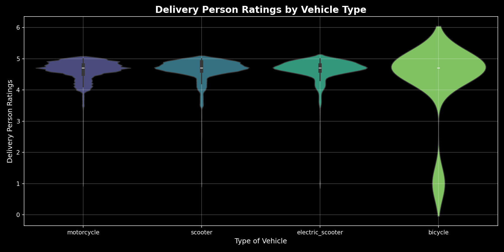

### Festival vs Non-Festival Delivery Time
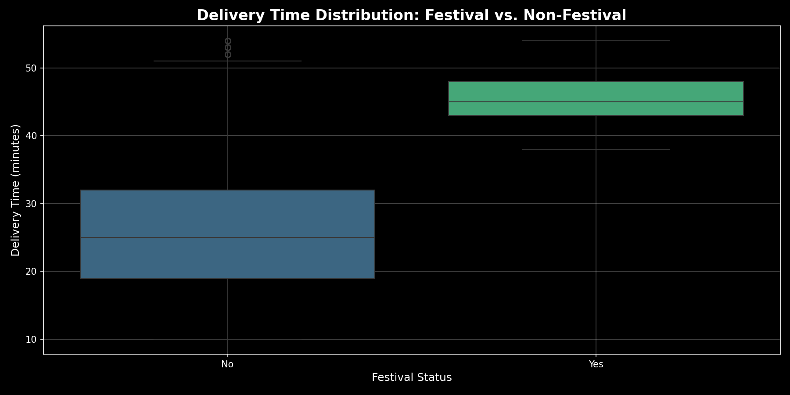

### Average Delivery Time by Weather & Traffic
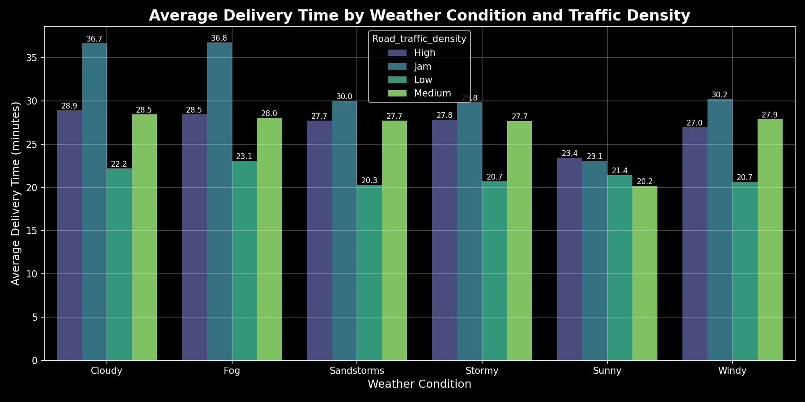

### Average Delivery Time by City & Vehicle Type
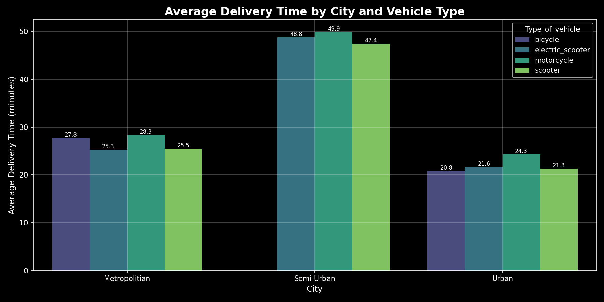

### Average Delivery Time by Order Hour & City
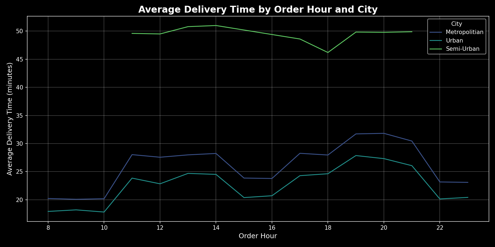

---

## 🤖 Machine Learning Results

**Target Variable:** `Time_taken(min)` — Regression Problem

**Features used:** Distance, Preparation time, Order hour, Day of week, Weather, Traffic density, City, Vehicle type, Delivery person age & ratings

| Model | RMSE | MAE | R² Score |
|-------|------|-----|----------|
| Linear Regression | 6.26 min | 4.96 min | 0.556 |
| Random Forest | **4.08 min** | **3.22 min** | **0.811** |
| XGBoost | 4.11 min | 3.26 min | 0.808 |

✅ **Best Model: Random Forest** — predicts delivery time within **±4 minutes** (R² = 0.81)

### Model Comparison
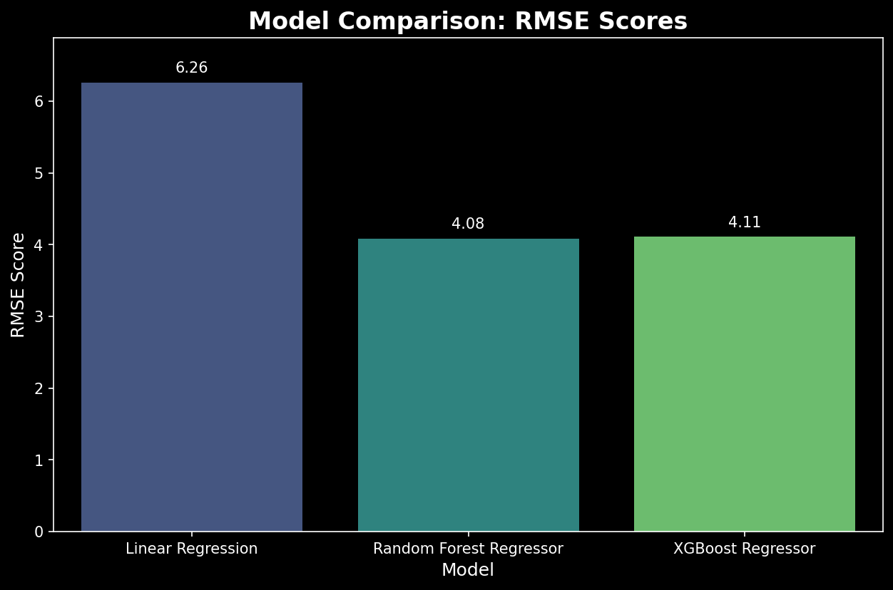

### Feature Importance (XGBoost)
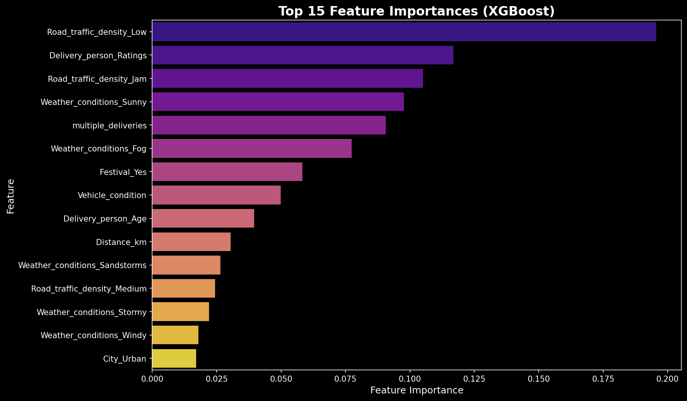

### Actual vs Predicted
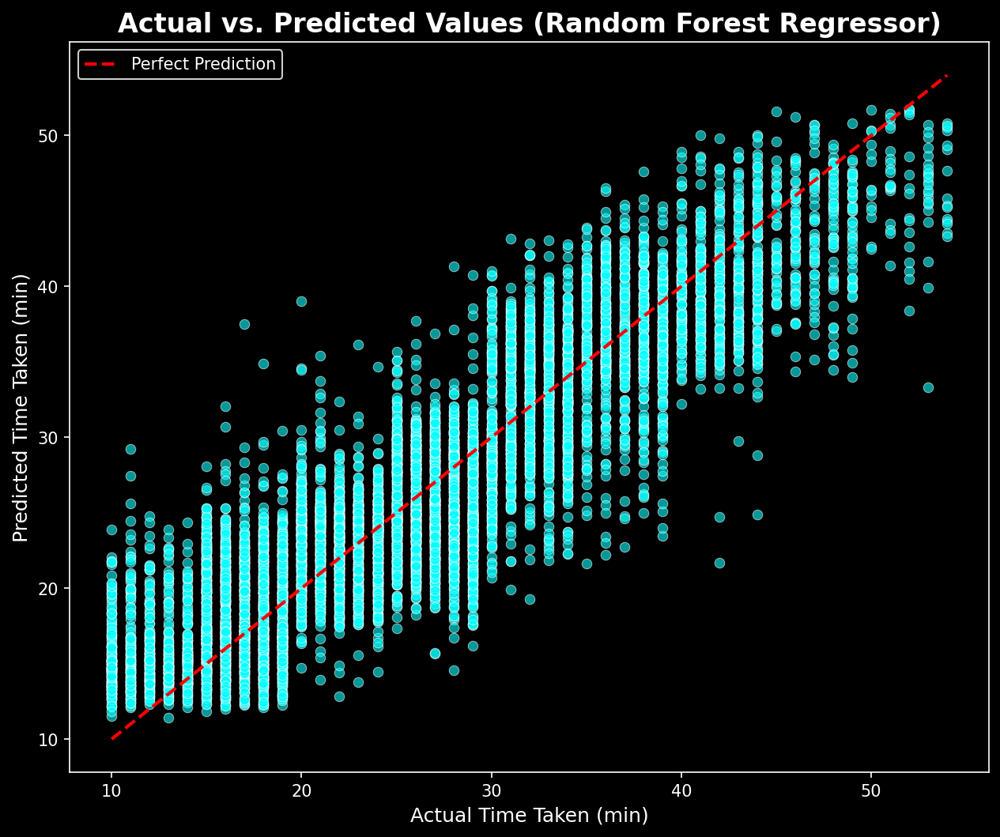

---

## 🛢️ SQL Analysis

20 queries written against a MySQL warehouse, including:

- **Window functions** — `RANK()`, `ROW_NUMBER()`, `LAG()`, `SUM() OVER()` for advanced ranking and trend analysis
- **City-level aggregations** — avg rating, avg cost, vote share %
- **Business metrics** — cost efficiency ranking, revenue simulation, online order impact
- **Comparative analysis** — book table impact on ratings, festival effect on delivery

---

## 🔍 Key Insights

- 🚦 **Traffic density** is the strongest predictor — Jam conditions average **31 min** vs Low traffic at **21 min**
- 🌫️ **Fog** causes the longest delays among weather conditions — median delivery ~28 min vs Sunny at ~19 min
- 🏙️ **Semi-Urban areas** have significantly longer delivery times (~49 min) vs Urban (~22 min) across all vehicle types
- 🎉 **Festival periods** add ~20 min on average — median jumps from 25 min to 45 min
- 🕙 **Peak hours are 19:00–20:00** — average delivery time spikes to 31–32 min across all days of the week
- 🚗 **Delivery person ratings** are the #2 most important ML feature — higher-rated partners deliver faster

---

## 🧰 Tech Stack

| Tool | Purpose |
|------|---------|
| Python (Pandas, NumPy) | Data cleaning & feature engineering |
| Matplotlib, Seaborn | EDA visualizations |
| Scikit-learn | Model training, scaling, evaluation |
| XGBoost | Gradient boosting regression |
| MySQL | Data warehouse + SQL analytics |

---

## 📁 Dataset

[Zomato Delivery Operations Analytics — Kaggle](https://www.kaggle.com/datasets/saurabhbadole/zomato-delivery-operations-analytics-dataset)

- 45,584 delivery records
- 20 original features
- Cities: Metropolitan, Urban, Semi-Urban
